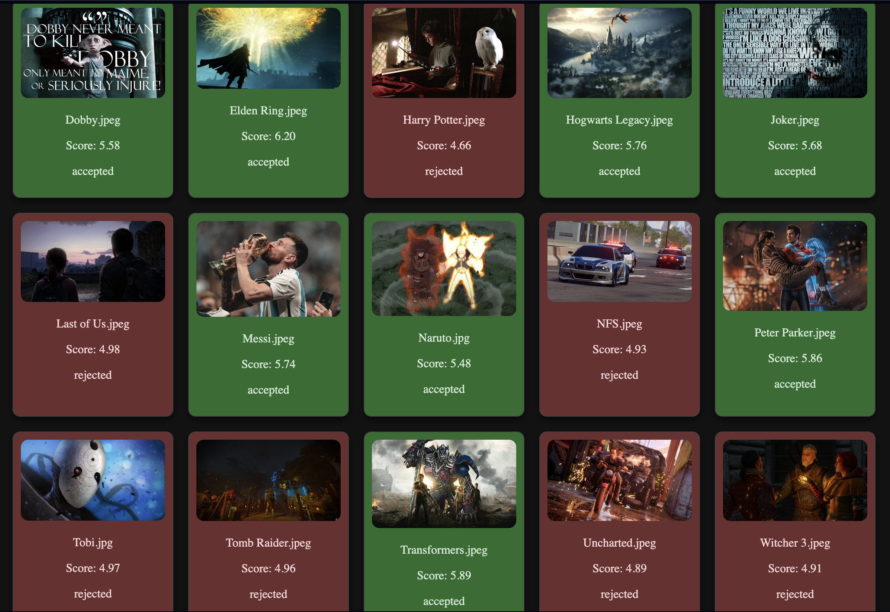

# Aesthetic Intelligence

A FastAPI application that implements **NIMA (Neural Image Assessment) NIMA (Neural Image Assessment)**, a deep learning model designed to predict the aesthetic quality of images. 
This application leverages the power of NIMA, built on top of **MobileNet**, to score images based on how visually appealing they are. 
Users can upload single images or a batch of images through this FastAPI service and receive aesthetic quality scores in return. 
The scores are based on a 10-point scale, where the more aesthetically pleasing the image is, the higher the score will be.

[](https://aestheticintelligence.onrender.com)

---

## Table of Contents
- [Aesthetic Intelligence](#aesthetic-intelligence)
  - [Table of Contents](#table-of-contents)
  - [NIMA Model Overview](#nima-model-overview)
    - [Why MobileNet?](#why-mobilenet)
  - [Scoring Methodology](#scoring-methodology)
  - [Setup Instructions](#setup-instructions)
    - [Prerequisites](#prerequisites)
    - [Clone the Repository](#clone-the-repository)
    - [Installing Dependencies](#installing-dependencies)
    - [Model Weights](#model-weights)
  - [Running the Application](#running-the-application)
  - [Contribution](#contribution)
  - [License](#license)

---

## NIMA Model Overview

In this implementation, we utilize **MobileNet** as the backbone of the NIMA model. MobileNet is a lightweight CNN (Convolutional Neural Network) designed for mobile and edge devices, which makes it suitable for image scoring tasks where computational resources might be limited.

The key idea behind NIMA is:
1. **Model Architecture**: MobileNet extracts image features, and the NIMA model then applies a softmax output layer with 10 nodes representing scores from 1 to 10.
2. **Scoring Mechanism**: The model outputs probabilities for each score, and a weighted average is calculated to get the mean score, which reflects the perceived aesthetic quality of the image.

For more on NIMA, [click here](https://ieeexplore.ieee.org/document/8352823)

### Why MobileNet?
MobileNet is known for its efficiency and accuracy in various image classification tasks. Its small size and fast inference speed make it ideal for mobile applications and scenarios where resources are limited, without sacrificing performance.

---

## Scoring Methodology

The image scoring process involves the following steps:
1. **Preprocessing**: Each image is resized to 224x224 (the input size expected by MobileNet).
2. **Prediction**: The image is passed through the MobileNet-based NIMA model, which outputs a probability distribution over scores ranging from 1 to 10.
3. **Score Calculation**: A weighted mean score is calculated from the probability distribution to give an overall score for the image.
4. **Classification**: If the mean score is above a threshold (5.1), the image is classified as "accepted"; otherwise, it is "rejected".

---

## Setup Instructions

### Prerequisites

Ensure you have the following tools installed on your machine:
- Python 3
- Git

### Clone the Repository

To get started, clone this repository using:

```bash
git clone https://github.com/yourusername/nima-image-scoring-api.git
cd nima-image-scoring-api
```

### Installing Dependencies

You can install the required dependencies using `pip`:

```bash
pip install -r requirements.txt
```

### Model Weights

You need to provide the pre-trained NIMA weights for MobileNet in the `weights/` directory. Make sure to download the weights and place them in the correct path:

```
weights/mobilenet_weights.h5
```

You can train the model separately or download pre-trained weights.

---

## Running the Application

After setting up the dependencies and model weights, you can run the FastAPI server with:

```bash
uvicorn app:app --host 0.0.0.0 --port 8000
```

The API will be available at `localhost:8000`.

---

## Contribution

Contributions are welcome! Here's how you can help:

- **Issues**: If you encounter any bugs or have suggestions for improvements, feel free to open an issue.

- **Pull Requests**: If you'd like to contribute, you can fork the repository, create a feature branch, and submit a pull request. 
Ensure that your code is properly formatted and thoroughly tested.

---

## License

This project is licensed under the MIT License. See the [LICENSE](LICENSE) file for details.
